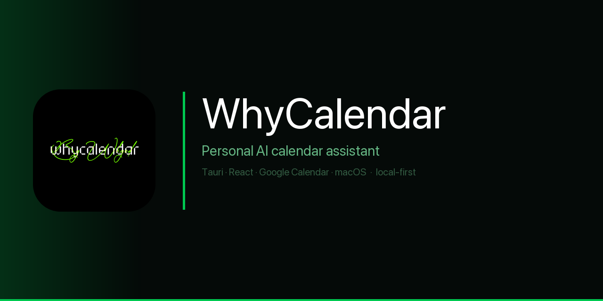
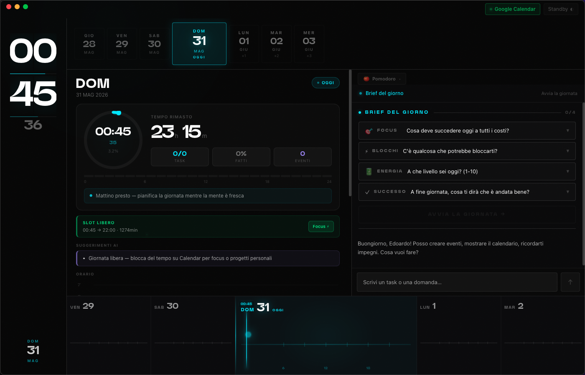

<p align="center">
  
</p>

<p align="center">
  <a href="https://github.com/OfficialWhyEd/WhyCalendar/stargazers"></a>
  <a href="https://discord.gg/cQQckfnN"></a>
  <a href="https://instagram.com/whyed.music"></a>
  <a href="https://officialwhyed.github.io/WhyCalendar"></a>
</p>

<br/>

> AI-native macOS calendar. Ask in plain language. WhyCalendar reads, writes, and plans your week autonomously — directly in your real Google Calendar.

---

## Philosophy

**Real calendar** — not a toy. Reads and writes your actual Google Calendar in real time. Events created through the AI appear on Google Calendar immediately, on every device.

**Natural language** — "Block Thursday 3pm for 2 hours" and it is done. No UI clicks, no drag and drop, no date picker.

**No API key** — uses Claude Code CLI as a subprocess (`claude --print`). If you have Claude Pro, the AI costs nothing extra. Zero Anthropic API key, zero metered billing.

**Native macOS** — Tauri 2 app bundle, menu bar, native notifications. Not an Electron wrapper. Not a browser tab.

**Time intelligence** — AI understands your calendar patterns and proactively spots optimizations: overloaded days, missing recovery time, recurring conflicts.

---

## What you can ask

| Prompt | What happens |
|--------|-------------|
| "What's free Thursday afternoon for a 2h focus block?" | Scans your real calendar, finds the slot, offers to create the event |
| "Block every Monday morning for deep work" | Creates a recurring event — checks conflicts first |
| "Reschedule tomorrow's 3pm to Friday" | Finds the event, checks Friday, moves it |
| "How many hours did I spend in meetings this week?" | Calculates from your actual events, breaks down by type |
| "Create a workout slot every day at 7am" | Recurring daily event, conflict-aware |
| "What's my busiest day next week?" | Ranks every day by committed hours |
| "Give me a recap of yesterday" | Synthesizes events + Pomodoro logs |
| "Is there time for a 90-minute deep work block this week?" | Scans the full week for contiguous free slots |

---

## How it works

```
Google Calendar API v3  →  WhyCalendar (Tauri 2)  →  Claude Code CLI
        |                                                    |
   OAuth PKCE                                     context injection
        |                                                    |
   read / write  ←──────────── calendar actions ────────────
```

---

<p align="center">
  
</p>

---

## Features

- **Google Calendar sync** — OAuth 2.0 PKCE, full read and write in real time
- **AI chat with calendar context** — ask anything about your schedule
- **Pomodoro timer + time tracking** — native focus timer per event
- **Daily AI recap** — briefing on demand: yesterday, today, tomorrow
- **Native macOS notifications** — upcoming events, Pomodoro completions, conflict alerts
- **WhySpidey mascot** — animated SVG mascot that reacts to calendar state

---

## WhyCalendar vs alternatives

| | WhyCalendar | Apple Calendar + Siri | Fantastical | Notion Calendar |
|---|---|---|---|---|
| Real Google Calendar write | Yes | Partial | Yes | Read-only |
| Natural language scheduling | Full AI | Basic Siri | Limited NLP | No |
| Free slot detection + auto-block | Yes | No | No | No |
| No API key required | Yes | Yes | No | No |
| Pomodoro + time tracking | Yes | No | No | No |
| Native macOS app | Yes | Yes | Yes | No (browser) |
| Fully open source | Yes | No | No | No |

---

## Stack

| Layer | Technology |
|-------|-----------|
| Frontend | React + TypeScript + Vite |
| Backend | Tauri 2 (Rust) |
| AI | Claude Code CLI — `claude --print` subprocess |
| Calendar | Google Calendar API v3 |
| Auth | OAuth 2.0 PKCE |
| Mascot | WhySpidey — animated SVG + Framer Motion |

---

## Setup

```bash
git clone https://github.com/OfficialWhyEd/WhyCalendar
cd WhyCalendar

npm install
cd src-tauri && cargo build && cd ..

# Configure Google OAuth credentials
cp .env.example .env
# Add GOOGLE_CLIENT_ID and GOOGLE_CLIENT_SECRET

npm run tauri dev
```

You need a Google Cloud project with the Calendar API enabled and OAuth 2.0 credentials (desktop app type). See `DESIGN_BRIEF.md` for full setup notes.

---

## Project structure

```
WhyCalendar/
├── src/
│   ├── components/    # Calendar, Timer, Chat, Mascot
│   ├── core/          # Google Calendar API client
│   ├── hooks/         # useCalendar, useTimer, useAI
│   └── utils/
└── src-tauri/         # Rust backend — OAuth, token storage, API calls
```

---

## Star History

[](https://star-history.com/#OfficialWhyEd/WhyCalendar&Date)

---

## Spread the word

If WhyCalendar saves you time, the best thing you can do is star the repo and share it. Every star helps the project reach more people who could use it.

- Star on GitHub
- Share on X / Instagram / Discord
- Open an issue with feedback or feature ideas

---

## Contributing

Pull requests are welcome. For major changes open an issue first to discuss what you want to change. The project uses Tauri 2 + React — familiarity with either side (Rust or React) is enough to get started.

---

<p align="center">
  Built by <a href="https://github.com/OfficialWhyEd">@whyed</a> · macOS · Tauri 2 · local-first · MIT License
</p>
